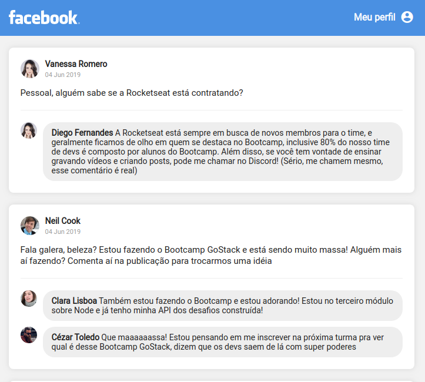

<h1 align="center">
  
</h1>

<h3 align="center">
  Desafio 4: Introdução ao React
</h3>

  <a href="#rocket-sobre-o-desafio">Sobre o desafio</a>&nbsp;&nbsp;&nbsp;|&nbsp;&nbsp;&nbsp;
  <a href="#memo-license">License</a>

## :rocket: Sobre o desafio

Criado uma aplicação do zero utilizando **Webpack, Babel, Webpack Dev Server e ReactJS**.

Nessa aplicação foi desenvolvido uma **interface** semelhante com a do **Facebook** utilizando React.

As informações contidas na interface são **estáticas**.

### Tela da aplicação

A aplicação foi divida em quatro componentes: Header, PostList, Post e Comment.

O layout da aplicação está [nesse link](.github/layout.sketch) que pode ser aberto por essa ferramenta gratuita e online: https://www.figma.com/

## :memo: License

Esse projeto está sob a licença MIT. Veja o arquivo [LICENSE](https://github.com/viniciusecp/gympoint-backend/blob/master/LICENSE.md) para mais detalhes.

---

Feito com ♥ by Vinicius Faustino Silva :wave: [Get in touch!](https://www.linkedin.com/in/vinícius-silva-019aa0165)
